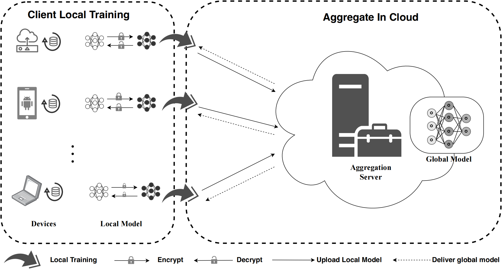

# FedSHE

[FedSHE](https://doi.org/10.1186/s42400-024-00232-w) is a privacy-preserving federated learning framework based on homomorphic encryption. It supports both Paillier and CKKS encryption schemes and provides performance analysis and comparison.



# Cite This Paper

If this work inspires or contributes to your paper or report, please consider citing our work.

```
@article{pan2024fedshe,
  title={FedSHE: privacy preserving and efficient federated learning with adaptive segmented CKKS homomorphic encryption},
  author={Pan, Yao and Chao, Zheng and He, Wang and Jing, Yang and Hongjia, Li and Liming, Wang},
  journal={Cybersecurity},
  volume={7},
  number={1},
  pages={40},
  year={2024},
  publisher={Springer}
}
```


# How TO USE

# 1. Install requirements

```
pip3 install -r requirements.txt
```
# 2. Train on MNIST

## 2.1 Plain Mode

with LetNet:
```
python3 main.py --gpu -1 --dataset mnist --model LeNet --num_channels 1  --epochs 10 --local_ep 10 --lr 0.015 --momentum 0.9 --mode Plain
```

with AlexNet:
```
python3 main.py --gpu -1 --dataset mnist --model AlexNet --num_channels 1  --epochs 10 --local_ep 10 --lr 0.015 --momentum 0.9 --mode Plain
```


## 2.2 Encrypt with Paillier

```
python3 main.py --gpu -1 --dataset mnist --num_channels 1  --epochs 10 --local_ep 10 --lr 0.015 --momentum 0.9 --mode Paillier --phe_key_len 128

python3 main.py --gpu -1 --dataset mnist --num_channels 1  --epochs 10 --local_ep 10 --lr 0.015 --momentum 0.9 --mode Paillier --phe_key_len 256
...

python3 main.py --gpu -1 --dataset mnist --num_channels 1  --epochs 10 --local_ep 10 --lr 0.015 --momentum 0.9 --mode Paillier --phe_key_len 2048
```

## 2.2 Encrypt with CKKS

### with different poly_modulus_degree

```
python3 main.py --gpu -1 --dataset mnist --num_channels 1  --epochs 10 --local_ep 10 --lr 0.015 --momentum 0.9 --mode CKKS --ckks_sec_level 128 --ckks_mul_depth 0 --ckks_key_len 1024
python3 main.py --gpu -1 --dataset mnist --num_channels 1  --epochs 10 --local_ep 10 --lr 0.015 --momentum 0.9 --mode CKKS --ckks_sec_level 128 --ckks_mul_depth 0 --ckks_key_len 2048
...
python3 main.py --gpu -1 --dataset mnist --num_channels 1  --epochs 10 --local_ep 10 --lr 0.015 --momentum 0.9 --mode CKKS --ckks_sec_level 128 --ckks_mul_depth 0 --ckks_key_len 32768

```

### with different  multiplication depth

```
python3 main.py --gpu -1 --dataset mnist --num_channels 1  --epochs 10 --local_ep 10 --lr 0.015 --momentum 0.9--mode CKKS --ckks_sec_level 128 --ckks_mul_depth 0 --ckks_key_len 1024
python3 main.py --gpu -1 --dataset mnist --num_channels 1  --epochs 10 --local_ep 10 --lr 0.015 --momentum 0.9--mode CKKS --ckks_sec_level 128 --ckks_mul_depth 0 --ckks_key_len 2048
...
python3 main.py --gpu -1 --dataset mnist --num_channels 1  --epochs 10 --local_ep 10 --lr 0.015 --momentum 0.9 --mode CKKS --ckks_sec_level 128 --ckks_mul_depth 0 --ckks_key_len 32768
```

### with different security level

```
python3 main.py --gpu -1 --dataset mnist --num_channels 1  --epochs 10 --local_ep 10 --lr 0.015 --momentum 0.9 --mode CKKS --ckks_sec_level 128 --ckks_mul_depth 0 --ckks_key_len 2048
python3 main.py --gpu -1 --dataset mnist --num_channels 1  --epochs 10 --local_ep 10 --lr 0.015 --momentum 0.9 --mode CKKS --ckks_sec_level 192 --ckks_mul_depth 0 --ckks_key_len 2048
...
python3 main.py --gpu -1 --dataset mnist --num_channels 1  --epochs 10 --local_ep 10 --lr 0.015 --momentum 0.9 --mode CKKS --ckks_sec_level 256 --ckks_mul_depth 0 --ckks_key_len 2048
```

# 3. Train on Cifar-10

## 3.1 Plain Mode

with LetNet:
```
python3 main.py --gpu -1 --dataset mnist --model LeNet --num_channels 1  --epochs 10 --local_ep 10 --lr 0.015 --momentum 0.9 --mode Plain
```

with AlexNet:
```
python3 main.py --gpu -1 --dataset mnist --model AlexNet --num_channels 1  --epochs 10 --local_ep 10 --lr 0.015 --momentum 0.9 --mode Plain
```

## 3.2 Encrypt with Paillier

```
python3 main.py --gpu -1 --dataset mnist --model LeNet  --num_channels 1  --epochs 10 --local_ep 10 --lr 0.015 --momentum 0.9 --mode Paillier --phe_key_len 128

python3 main.py --gpu -1 --dataset mnist --model LeNet  --num_channels 1  --epochs 10 --local_ep 10 --lr 0.015 --momentum 0.9 --mode Paillier --phe_key_len 256

...

python3 main.py --gpu -1 --dataset mnist --model LeNet --num_channels 1  --epochs 10 --local_ep 10 --lr 0.015 --momentum 0.9 --mode Paillier --phe_key_len 2048

```

## 3.2 Encrypt with CKKS

### with different poly_modulus_degree

```
python3 main.py --gpu -1 --dataset cifar --model LeNet --num_channels 1  --epochs 10 --local_ep 10 --lr 0.015 --momentum 0.9 --mode CKKS --ckks_sec_level 128 --ckks_mul_depth 0 --ckks_key_len 1024

python3 main.py --gpu -1 --dataset cifar --model LeNet --num_channels 1  --epochs 10 --local_ep 10 --lr 0.015 --momentum 0.9 --mode CKKS --ckks_sec_level 128 --ckks_mul_depth 0 --ckks_key_len 2048

...
python3 main.py --gpu -1 --dataset cifar --model LeNet --num_channels 1  --epochs 10 --local_ep 10 --lr 0.015 --momentum 0.9 --mode CKKS --ckks_sec_level 128 --ckks_mul_depth 0 --ckks_key_len 32768
```

### with different  multiplication depth

```
python3 main.py --gpu -1 --dataset cifar --model LeNet --num_channels 1  --epochs 10 --local_ep 10 --lr 0.015 --momentum 0.9 --mode CKKS --ckks_sec_level 128 --ckks_mul_depth 0 --ckks_key_len 1024

python3 main.py --gpu -1 --dataset cifar --model LeNet --num_channels 1  --epochs 10 --local_ep 10 --lr 0.015 --momentum 0.9 --mode CKKS --ckks_sec_level 128 --ckks_mul_depth 1 --ckks_key_len 1024
...
python3 main.py --gpu -1 --dataset cifar --model LeNet --num_channels 1  --epochs 10 --local_ep 10 --lr 0.015 --momentum 0.9 --mode CKKS --ckks_sec_level 128 --ckks_mul_depth 5 --ckks_key_len 1024

```

### with different security level

```
python3 main.py --gpu -1 --dataset cifar --model LeNet --num_channels 1  --epochs 10 --local_ep 10 --lr 0.015 --momentum 0.9 --mode CKKS --ckks_sec_level 128 --ckks_mul_depth 0 --ckks_key_len 2048
python3 main.py --gpu -1 --dataset cifar --model LeNet --num_channels 1  --epochs 10 --local_ep 10 --lr 0.015 --momentum 0.9 --mode CKKS --ckks_sec_level 192 --ckks_mul_depth 0 --ckks_key_len 2048
...
python3 main.py --gpu -1 --dataset cifar --model LeNet --num_channels 1  --epochs 10 --local_ep 10 --lr 0.015 --momentum 0.9 --mode CKKS --ckks_sec_level 256 --ckks_mul_depth 0 --ckks_key_len 2048
```
